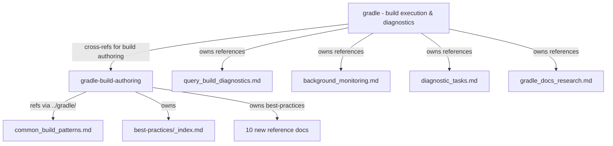

# Requirements

### Overview & Goals

Split the mixed-audience `gradle` skill into two dedicated skills — one for Gradle **build execution** (software engineers running builds/tests) and one for Gradle **build authoring** (build engineers writing/maintaining build scripts and plugins) — and refine the build-authoring content to fill identified gaps.

### Scope

#### In Scope

- Create a new `gradle-build-authoring` skill directory and `SKILL.md` with complete frontmatter, constitution, directives, workflows, when-to-use, examples, and resources sections.
- Migrate build-authoring content from `gradle/SKILL.md` (Constitution rules 11–15, Idiomatic DSL Patterns, Creating a New Module workflow, Performance Audit workflow, Build Logic Refactoring, related When to Use entries, relevant examples) into the new skill.
- Remove the migrated content from `gradle/SKILL.md`, add a cross-reference to `gradle-build-authoring`, and update its frontmatter to be purely about build execution/testing/diagnostics.
- Author 10 new gap-filling reference documents for build authoring: version catalogs, testing configuration, CI/CD builds, dependency locking, Worker API, JDK toolchains, build scans, continuous builds, Kotlin compiler options, artifact publishing.
- Expand `common_build_patterns.md` with a build-logic composite build section.
- Update OpenSpec specs (`skill-metadata`, `gradle-build-authoring`) and create delta specs.

#### Out of Scope

- Changes to the other 4 skills (`exploring_dependency_sources`, `managing_gradle_dependencies`, `interacting_with_project_runtime`, `verifying_compose_ui`) — they are already cleanly targeted.
- Changes to the best-practices generator pipeline (`GenerateBestPracticesDoc.kt`) — output path changed to `gradle-build-authoring/references/best-practices/`.
- Changing the physical location of `common_build_patterns.md` (stays under `gradle/references/`; cross-referenced via relative paths).
- Modifying runtime skill loading code (`SkillTools.kt`) or build configuration.

### Functional Requirements

1. **`gradle` skill** — After the split, it must contain **zero** build-authoring content. Its constitution must only cover tool-invocation rules (task paths, test selection, `query_build`, `captureTaskOutput`, foreground/background execution, `gradle_docs` tag syntax). Its frontmatter must explicitly exclude build script authoring and plugin development. It must include a cross-reference directing build-authoring questions to `gradle-build-authoring`.

2. **`gradle-build-authoring` skill** — Must be a complete, standalone skill with: frontmatter describing build-authoring scope with negative triggers excluding build execution; constitution with migrated + new rules; directives for DSL patterns, version catalogs, configuration cache, JDK toolchains; workflows for module creation, performance audit, build logic refactoring, dependency addition, testing setup, CI/CD setup, dependency locking, artifact publishing; 7+ tool-call examples; resources linking to `common_build_patterns.md`, `best-practices/`, and the 10 new reference documents.

3. **Cross-skill reference paths** — `gradle-build-authoring` references to `common_build_patterns.md` must use relative paths (`../gradle/references/...`). The `best-practices/` directory resides in `gradle-build-authoring/references/best-practices/` (generator output moved).

4. **Frontmatter conformity** — Both skills' frontmatter descriptions must follow the skill-metadata spec: 1–2 sentence capability statement + positive triggers + explicit negative triggers.

5. **Purity** — `gradle/SKILL.md` must contain zero DSL patterns, lazy API mandates, convention plugin guidance, or build-logic refactoring guidance. `gradle-build-authoring/SKILL.md` must contain zero tool-execution patterns (`query_build`, `captureTaskOutput`, `--tests` filtering syntax, background build management).

6. **Packaging** — Both skills must be packaged into `skills.zip` via the existing `zipSkills` task with no configuration changes.

### Non-Functional Requirements

- **No build configuration changes** to `build.gradle.kts` or `SkillTools.kt`.
- **Backward compatibility** — Existing projects using the `gradle` skill must continue to work; build-authoring queries that previously matched `gradle` must now route to `gradle-build-authoring`.
- **All generated best-practices content stays generated** — no hand-editing of generated files.
- **Best-practices physically move** — The generator output path changes from `gradle/references/best-practices/` to `gradle-build-authoring/references/best-practices/`. The gradle skill no longer references best-practices.

# Technical Design

### Current Implementation

The analysis (conducted in previous session) revealed:

- **`gradle/SKILL.md`** (347 lines) is the only mixed-audience skill. It contains 20 constitution rules where rules 1–10 target Gradle users (tool invocation) and rules 11–20 target build authors (DSL, plugins). It includes an "Idiomatic DSL Patterns" section (build-author), workflows for both audiences interleaved, and resources linking to `common_build_patterns.md` and `best-practices/` (both build-author).
- **Other 4 skills** are cleanly targeted at Gradle users.
- **Reference documents:** `query_build_diagnostics.md`, `background_monitoring.md`, `diagnostic_tasks.md`, `gradle_docs_research.md` (all Gradle users); `common_build_patterns.md` (build authors, physically under `gradle/references/`).
- **Packaging:** `src/main/skills/` is zipped into `skills.zip` by `zipSkills` task; no path restrictions.

### Key Decisions

 Decision | Choice | Rationale |
----------|--------|-----------|
 Physical location of generated refs | `best-practices/` moves to `gradle-build-authoring/references/best-practices/` | Generator output path changed; best-practices are build-author content and belong with the build-authoring skill. `zipSkills` handles subdirectories recursively. |
 New ref location | `gradle-build-authoring/references/` | Hand-authored, exclusively build-author concerns; natural home |
 `gradle_docs` rule | Keep in both skills | Applies to both audiences (build execution diagnosis vs. build-quality research) |
 `:properties --property` rule | Keep in `gradle` only | Tool-usage pattern, not build-authoring |
 Version bump | `gradle` → "5.0", `gradle-build-authoring` → "1.0" | Reflects major restructure |

### Proposed Changes

#### Architecture Diagram



#### Content Migration Map

 Source (gradle/SKILL.md) | Destination | Action |
---|---|---|
 Constitution rules 11–15 (Kotlin DSL, lazy APIs, version catalogs, existing conventions, safe navigation) | `gradle-build-authoring` Constitution | Move + add 3 new rules (no allProjects, no Project in tasks, no config-phase resolution) |
 Idiomatic DSL Patterns | `gradle-build-authoring` Directives | Move + expand |
 Creating a New Module workflow | `gradle-build-authoring` Workflows | Move + expand with convention plugins |
 Performance Audit workflow | `gradle-build-authoring` Workflows | Move + expand with build scans |
 Build Logic Refactoring | `gradle-build-authoring` Workflows | Move |
 New Module Creation, Build Logic Refactoring, Performance Troubleshooting (When to Use) | `gradle-build-authoring` When to Use | Move |
| best-practices/_index.md (Resources) | `gradle-build-authoring` Resources | Move (now co-located in `gradle-build-authoring/references/best-practices/`) |
| common_build_patterns.md (Resources) | `gradle-build-authoring` Resources | Move (cross-ref via `../gradle/references/common_build_patterns.md`) |
 Create sub-project module example | `gradle-build-authoring` Examples | Move |

**Stays in `gradle`:** All tool-invocation patterns, `query_build`/`wait_build`, test selection syntax, task path syntax, foreground/background execution, `captureTaskOutput`, `gradle_docs` tag syntax, diagnostic/monitoring references, troubleshooting.

#### New Reference Documents (10 files in `gradle-build-authoring/references/`)

1. **`version-catalogs.md`** — Full `libs.versions.toml` example (versions, libraries, bundles, plugins), type-safe accessors, multi-catalog setups.
2. **`testing-configuration.md`** — JUnit 5 platform setup, test logging, task customization, KMP targeting, test fixtures.
3. **`ci-cd-builds.md`** — `--no-daemon`, `--scan`, parallel execution, build cache in CI, environment isolation, GitHub Actions caching.
4. **`dependency-locking.md`** — `dependencyLocking {}`, lockfile generation, CI verification.
5. **`worker-api.md`** — `WorkerExecutor`, isolation modes, parallel custom task actions.
6. **`jdk-toolchains.md`** — Toolchain config, auto-provisioning, foojay resolver, Kotlin interop.
7. **`build-scans.md`** — Develocity plugin, publishing config, CI integration, interpretation.
8. **`continuous-builds.md`** — `--continuous`, `--watch-fs`, use cases, limitations.
9. **`kotlin-compiler-options.md`** — `compilerOptions {}`, `jvmTarget`, `freeCompilerArgs`, KMP patterns.
10. **`artifact-publishing.md`** — maven-publish, publications, signing, POM customization.

### File Structure

```
src/main/skills/
├── gradle/
│   ├── SKILL.md                          # MODIFIED: trimmed to build execution only
│   └── references/
│       ├── query_build_diagnostics.md    # UNCHANGED
│       ├── background_monitoring.md      # UNCHANGED
│       ├── diagnostic_tasks.md           # UNCHANGED
│       ├── gradle_docs_research.md       # UNCHANGED
│       ├── common_build_patterns.md      # MODIFIED: add build-logic composite build section
│       └── best-practices/               # REMOVED: moved to gradle-build-authoring/references/
├── gradle-build-authoring/               # NEW
│   ├── SKILL.md                          # NEW: complete skill
│   └── references/
│       ├── best-practices/               # MOVED FROM gradle/references/: now lives here
│       │   ├── _index.md                 # (generated)
│       │   └── ...36 files...            # (generated)
│       ├── version-catalogs.md           # NEW
│       ├── testing-configuration.md      # NEW
│       ├── ci-cd-builds.md               # NEW
│       ├── dependency-locking.md         # NEW
│       ├── worker-api.md                 # NEW
│       ├── jdk-toolchains.md             # NEW
│       ├── build-scans.md                # NEW
│       ├── continuous-builds.md          # NEW
│       ├── kotlin-compiler-options.md    # NEW
│       └── artifact-publishing.md        # NEW
├── exploring_dependency_sources/         # UNCHANGED
├── managing_gradle_dependencies/         # UNCHANGED
├── interacting_with_project_runtime/     # UNCHANGED
└── verifying_compose_ui/                 # UNCHANGED

### Risks

 Risk | Mitigation |
------|------------|
 Cross-skill relative paths fail at runtime | Verify `SkillTools.installSkills` handles nested `references/` directories with relative paths. If not, copy shared refs into `gradle-build-authoring/references/` during `zipSkills`. |
 Agent routing overlap (both skills mention `gradle_docs`) | Frontmatter negative triggers make boundaries explicit. Scoped to lookup during diagnosis (`gradle`) vs. build-quality research (`gradle-build-authoring`). |
 Skill count increase (5→6) adds agent discovery overhead | Mutually exclusive frontmatter descriptions with clear negative triggers. |
 `:properties --property` rule removed from both by mistake | Explicitly keep in `gradle` constitution as migration rule. |

# Testing

### Validation Approach

Each stage below includes verification of the changes made. The primary validation is structural verification of file contents, reference path resolution, and audience-purity checks.

### Key Scenarios

1. **Audience purity of `gradle/SKILL.md`** — Verify it contains no DSL patterns, lazy API mandates, convention plugin guidance, or build-logic refactoring guidance. Verify it contains a cross-reference to `gradle-build-authoring`.

2. **Audience purity of `gradle-build-authoring/SKILL.md`** — Verify it contains no `query_build`, `captureTaskOutput`, `--tests` filtering syntax, or background build management.

3. **Reference path resolution** — Verify all relative paths (`../gradle/references/...`) in `gradle-build-authoring` resolve to existing files.

4. **Frontmatter compliance** — Verify both skills' frontmatter descriptions follow the three-part pattern (capability + positive triggers + negative triggers).

5. **Packaging** — Run `./gradlew zipSkills` and verify both skills are in the resulting zip.

6. **Build health** — Run `./gradlew check` to confirm no regressions.

7. **Tool metadata** — Run `./gradlew :updateToolsList` if any MCP tool descriptions reference skill names that changed.

### Edge Cases

- **Empty `references/` directory in new skill** — Before finalizing, verify all 10 new reference docs exist and are non-empty.
- **Stale constitution rules** — Verify no build-authoring constitution rules remain in `gradle/SKILL.md`.
- **Cascading frontmatter changes** — Ensure no other spec references the old `gradle` skill description verbatim.

# Delivery Steps

###   Step 1: Create gradle-build-authoring skill skeleton
The new `gradle-build-authoring/` directory exists with a complete SKILL.md and empty references/ directory.

- Create `src/main/skills/gradle-build-authoring/` directory.
- Create `src/main/skills/gradle-build-authoring/references/` directory.
- Create `src/main/skills/gradle-build-authoring/SKILL.md` with:
  - Full YAML frontmatter (name: gradle-build-authoring, description with capability + positive triggers + negative triggers, license, metadata version "1.0").
  - Title: "Authoritative Gradle Build Authoring & Build Logic Engineering".
  - Section stubs: Constitution, Directives, Workflows, When to Use, Examples, Resources.

###   Step 2: Migrate build-authoring content from gradle/SKILL.md to gradle-build-authoring/SKILL.md
Build-authoring content is relocated from `gradle/SKILL.md` into `gradle-build-authoring/SKILL.md`.

- Migrate Constitution rules 11–15 (Kotlin DSL, lazy APIs, version catalogs, existing conventions, safe navigation). Add 3 new rules: "NEVER use allprojects/subprojects; use convention plugins", "NEVER access Project object inside task actions", "NEVER resolve configurations during configuration phase".
- Migrate the "Idiomatic DSL Patterns" directive section and expand it.
- Migrate "Creating a New Module" workflow and expand with convention plugin application.
- Migrate "Performance Audit" workflow and expand with build scan step.
- Migrate "New Module Creation", "Build Logic Refactoring", "Performance Troubleshooting" from When to Use.
- Migrate the "Create a new sub-project module" example.
- Migrate resource links for `common_build_patterns.md` and `best-practices/_index.md`. `best-practices/` now co-located under `gradle-build-authoring/references/best-practices/` (no cross-ref path needed). `common_build_patterns.md` uses relative path `../gradle/references/...`.

###   Step 3: Clean up gradle/SKILL.md to remove build-authoring content
`gradle/SKILL.md` is trimmed to build execution only, with a cross-reference to the new skill.

- Remove migrated Constitution rules (11–15). Keep rules 1–10 plus `:properties --property` and `gradle_docs` rules.
- Remove "Idiomatic DSL Patterns" section.
- Remove "Creating a New Module" and "Performance Audit" workflows.
- Remove migrated When to Use entries.
- Remove migrated example.
- Remove resource links for `best-practices/` and `common_build_patterns.md`.
- Add "Build Authoring" cross-reference section after Constitution directing to `gradle-build-authoring`.
- Add "Build Script Changes" negative trigger to When to Use.
- Update frontmatter: revise description to remove "creating modules" and "performance audits"; add negative trigger for `gradle-build-authoring`; bump version to "5.0".

###   Step 4: Write 10 gap-filling reference documents
10 new hand-authored reference documents exist in `gradle-build-authoring/references/`, each covering a previously underserved build-authoring topic.

- `version-catalogs.md` — Full `libs.versions.toml` example with all four sections, type-safe accessor usage.
- `testing-configuration.md` — JUnit 5 setup, test logging, task customization, KMP targeting, test fixtures.
- `ci-cd-builds.md` — Daemon management, `--scan`, parallel execution, caching, environment isolation, GitHub Actions patterns.
- `dependency-locking.md` — `dependencyLocking {}`, lockfile generation, CI verification.
- `worker-api.md` — `WorkerExecutor`, isolation modes, parallel work patterns.
- `jdk-toolchains.md` — Toolchain configuration, auto-provisioning, foojay resolver.
- `build-scans.md` — Develocity plugin, publishing config, CI integration, interpretation.
- `continuous-builds.md` — `--continuous`, `--watch-fs`, use cases, limitations.
- `kotlin-compiler-options.md` — `compilerOptions {}`, `jvmTarget`, `freeCompilerArgs`, KMP patterns.
- `artifact-publishing.md` — maven-publish, publications, signing, POM customization.

###   Step 5: Expand common_build_patterns.md and complete gradle-build-authoring skill body
Existing reference is expanded and the new skill body is fully fleshed out with all sections.

- Add "Build-Logic Composite Build Setup" section to `gradle/references/common_build_patterns.md`: `includeBuild("build-logic")`, precompiled script plugins, type-safe project accessors.
- Change `GenerateBestPracticesDoc.kt` output path from `gradle/references/best-practices/` to `gradle-build-authoring/references/best-practices/`.
  - Update `writePages()` function (or `main()`) to accept new output directory.
  - Update any tests that hardcode the output path.
  - Run generator to produce best-practices in the new location.
  - Remove stale `gradle/references/best-practices/` directory.
- Write remaining sections of `gradle-build-authoring/SKILL.md`:
  - Directives: Idiomatic DSL Patterns (expanded), Version Catalog Structure, Configuration Cache Compatibility, JDK Toolchain Management, Best-Practices Consultation.
  - Workflows: Creating a New Module, Performance Audit, Build Logic Refactoring, Adding a Dependency, Configuring Testing, Setting Up CI/CD Builds, Enabling Dependency Locking, Publishing Artifacts.
  - When to Use (8 scenarios).
  - Examples (7 examples with JSON tool invocations and reasoning comments).
  - Resources section linking all reference documents (existing + new + best-practices).

###   Step 6: Verify skill purity, packaging, and build health
All changes are validated for correctness.

- Verify `gradle/SKILL.md` contains zero build-authoring content (no DSL patterns, no convention plugins, no lazy API mandates).
- Verify `gradle-build-authoring/SKILL.md` contains zero tool-execution content (no `query_build`, no `captureTaskOutput`, no `--tests` syntax).
- Verify all relative reference paths resolve correctly from each skill's directory.
- Verify frontmatter descriptions follow the skill-metadata spec (three-part pattern).
- Run `./gradlew zipSkills` and confirm both skills appear in `skills.zip`.
- If any MCP tool descriptions reference skill names, run `./gradlew :updateToolsList`.
- Run `./gradlew check` and confirm BUILD SUCCESSFUL.